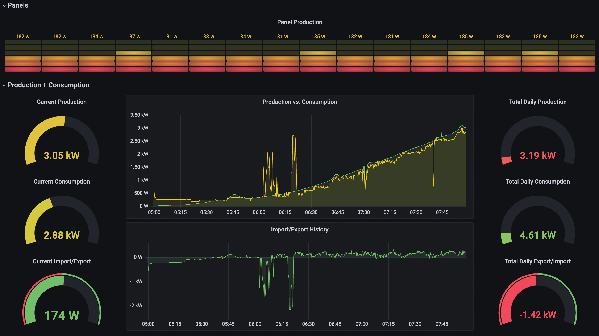

# Emotional Solar Coaster

An experimental Docker setup that spins up Telegraf, InfluxDB and Grafana with a pre-made dashboard that monitors an Enphase Envoy solar PV system. This is currently running on an Envoy with firmware version D7.0.88.



This is running on a Raspberry Pi 3b+, although also tested on a Macbook Pro M1 Max running Mac OS 12.6.1.

Setup inspired by https://github.com/testsmith-io/jmeter-influxdb-grafana-docker

Disclaimer: This is the first time I've toyed with Telegraf, InfluxDB and Grafana - so things might be a bit messy :) This is provided as is and no support provided.

## Telegraf

Uses two HTTP inputs to read metrics from two Envoy API endpoints, and pushes them into InfluxDB.

* `/production.json?details=1`
* `/api/v1/production/inverters`

### Config

There are various configuration items available within `main.env`, some of these include:

* `DOCKER_INFLUXDB_INIT_BUCKET` - the InfluxDB bucket metrics are pushed into
* `DOCKER_TELEGRAF_INTERVAL` - the interval that API endpoints are polled
* `DOCKER_TELEGRAF_AUTH_RENEW` - how often Telegraf should renew its cookie auth value (see below)


### Authentication

The Envoy API endpoints all require cookie authentication. This is handled by Telegraf via the http input `cookie_auth` properties - check the telegraf.conf file for examples.

* This is simple cookie authentication and is based off a `sessionId` cookie.
* Its value needs to be populated based off a request to /auth/check_jwt:
 * The request requires a `Authorization: Bearer <TOKEN>` header
 * The `<TOKEN>` value is a long-lived JWT token obtained from https://entrez.enphaseenergy.com
 * This token is obtained manually (but can be automated). Refer to this URL for more details: https://store-d9.enphase.com/download/iq-gateway-access-using-token-tech-brief

Other helpful resources were:

* https://thecomputerperson.wordpress.com/2016/08/28/reverse-engineering-the-enphase-installer-toolkit/
* https://pastebin.com/8pa1hKU6

## InfluxDB

Single DB "enphase". Nothing fancy.

## Grafana

Single Dashboard "Emotional Solar Coaster".

### Dashboard Variables:

* `INFLUXDB_BUCKET` - specifies the InfluxDB Bucket for the InfluxDB queries within the dashboard
  * N.B. I could not find a way to populate the variable value directly from the `main.env` or environment variables - so it is hardcoded within the `solar-main.json` dashboard.
* `GRAPH_WINDOW_SIZE` - specifies an interval set allowing the aggregate window size on the graph queries to be changed dynamically

### Gauges

NOTE: The gauge min/max values are inferred from theoretical limits of my particular system - adjust these as required. For example:
* `Current Production` max value of 5,850
* `Current Consumption` max value of 7,000 (I really hope I never hit that!)
* `Total Daily Production` max value of 65,000
* `Total Daily Consumption` max value of 55,000
* `Current Import/Export` min/max value of -6,000/+6,000 (negative when importing from grid)
* `Total Daily Export/Import` min/max value of -40,000/+40,000 (negative when net import grid greater than production)

# Raspberry Pi setup:

This is running on a Raspberry Pi 3b+, although also tested on a Macbook Pro M1 Max running Mac OS 12.6.1.

* Fresh image - ensure 64bit install of Raspberry Pi OS

## Steps:

Basic overview of what was run on the PI to get it ready and running Docker.

```
# initial
sudo apt-get update
sudo apt-get upgrade
sudo apt-get install git vim
sudo reboot

# install docker
cd ~
mkdir workspace
cd ~/workspace/
curl -fsSL https://get.docker.com -o get-docker.sh
sudo sh get-docker.sh
usermod -aG docker pi
sudo usermod -aG docker pi

# install docker-compose
sudo apt-get install libffi-dev libssl-dev
sudo apt install python3-dev
sudo apt-get install -y python3 python3-pip
sudo pip3 install docker-compose

# setup ssh
cd ~
mkdir .ssh
touch ~/.ssh/github_id_rsa
# --> populate with relevant key.

chmod 600 ~/.ssh/github_id_rsa
echo -e "Host github.com\n\tHostName github.com\n\tIdentityFile ~/.ssh/github_id_rsa" >> ~/.ssh/config

# clone repo (this repo - lol)
cd ~/workspace/
git clone git@github.com:berniezajac/emotional-solar-coaster.git

# set perms on bound volume directories
cd ~/workspace/emotional-solar-coaster
mkdir -p influxdb/data
mkdir -p grafana/data

# Was not required on the Mac, but needed to do this on the Pi.
sudo chown -R 472:472 influxdb/data
sudo chown -R 472:472 grafana/data

# update main.env with enphase ip and JWT
vim main.env

# Spin up docker!
docker-compose up
```

